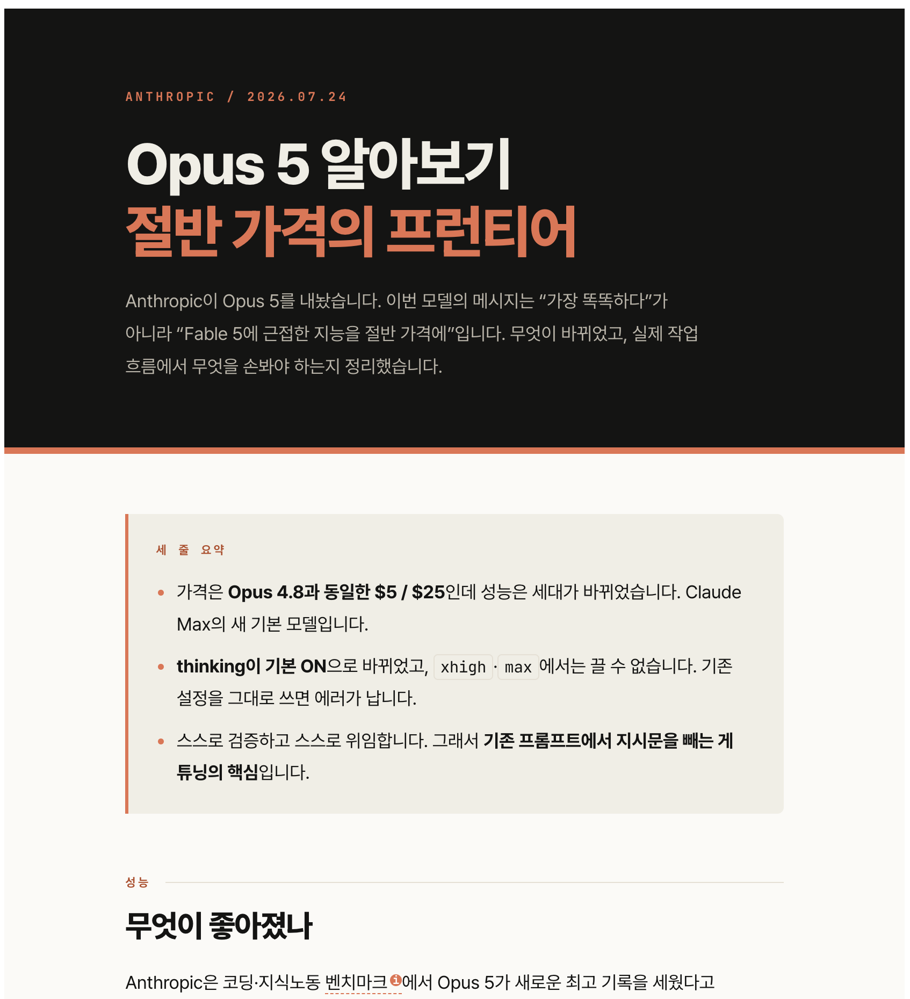
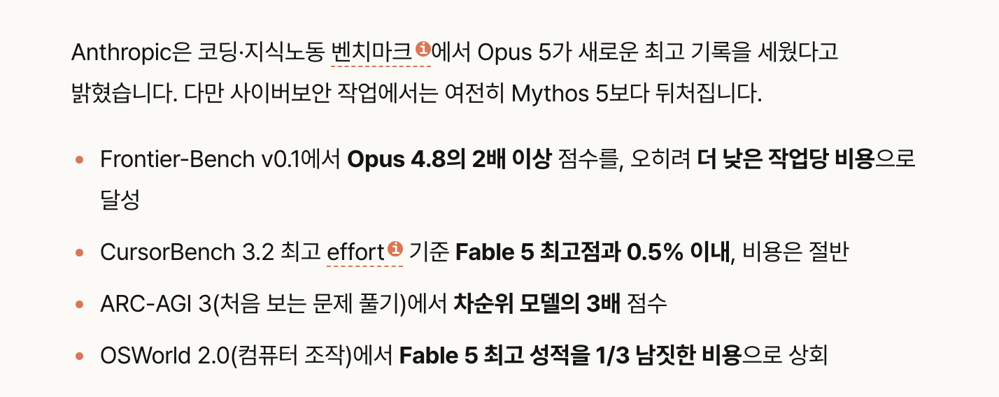
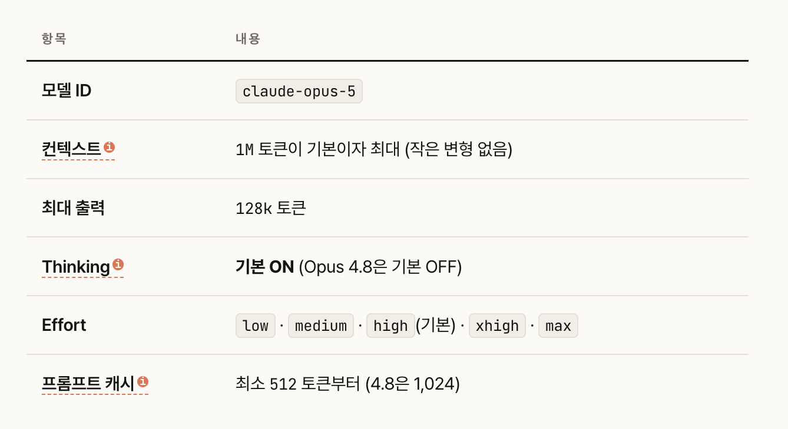
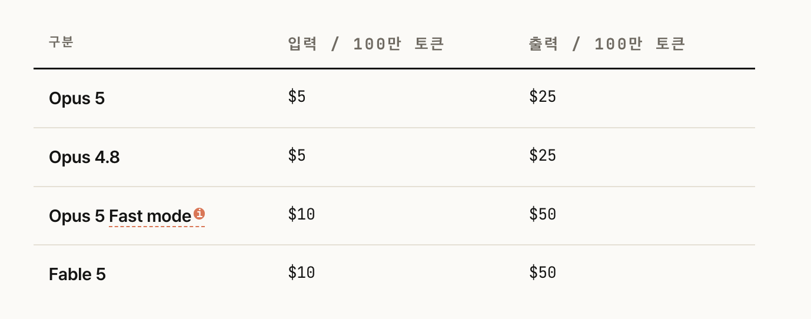
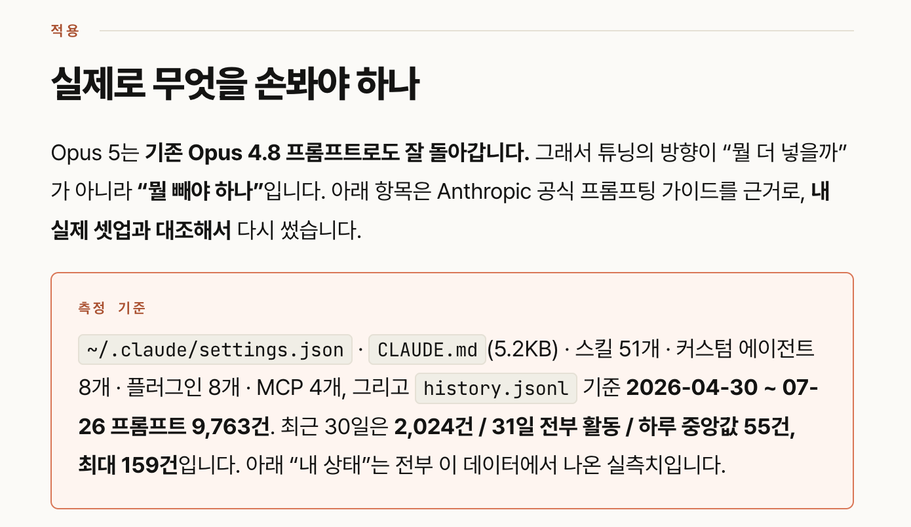
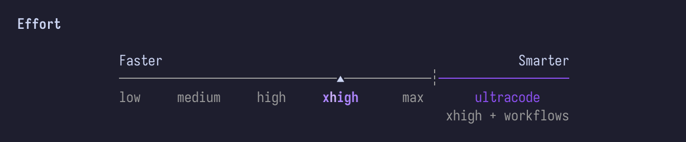
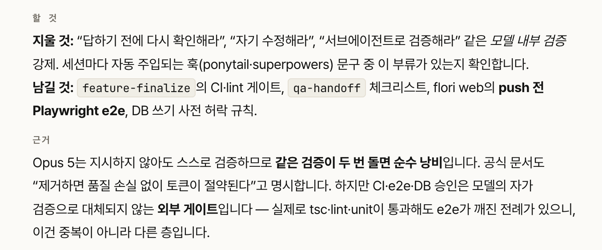

# 서론

최근(7/24)에 클로드 Opus 5 모델이 출시되었다.
Fable 5가 나와서 사람들이 충격을 받고 막 사용해 보던 게 얼마 되지 않았는데 또 출시라니, 따라가기가 참 벅차다 😅

오랜만에 공부도 좀 해볼 겸, 신모델에 대해서 조사하고 정리해보고 한다.
대부분의 내용은 앤트로픽 공식문서 기반이고, 클로드코드를 활용해서 초안을 뽑았다.

ps. 여담이지만 AI가 정리를 너무 잘해준다.. HTML로 뽑아달라고 하면 가독성도 좋고, 간단한 동작도 하게 할 수 있어서 더 좋다. 그대로 올리는 게 더 좋지 않을까라는 생각이 들 정도다 😂 그래도 알고 쓰는 게 좋으니 최대한 이해하고 넘어가보고자 한다!

---
# Opus 5, 무엇이 개선되었을까?

이번 모델을 한 줄로 정리하면,
**"Fable 5와 유사한 성능에 가격은 절반."** 이라고 한다.

Fable 5 모델이 많이 비싸고, 사용하는데 다양한 제약(미국에서 수출 금지)들이 있었기 때문에 복잡한 작업을 수행중인 사람들에게는 희소식이다. 나는 그정도로 복잡한 일을 하지 않아서 Fable 5을 사용하는 것에 간절하지는 않았지만, 확실히 더 똑똑하다는 것은 느껴지긴 했었다.

벤치마크 결과가 의미가 있지만, 맹신할 수도 없다. 왜냐하면 **"정말 동일한 환경에서 측정된 것인가?"** 에 대한 의문이 있기 때문이다.

정확한 답을 뽑아내는 것만큼 중요한 것이, 그 **답을 도출해내는 데 걸리는 1)시간과 2)비용**이다. 이전에 비해서 좋은 성능이 나왔다고 해도 시간과 비용을 많이 쓴다면 오히려 더 좋지 않을 수 있다.

그러나 이번 모델은 비용을 확실히 잡으면서도 높은 성능을 보여주었다는 점에서 의미가 있다. 그렇기에 앤트로픽에서 Opus '5'로 릴리즈를 한 것이 아닌가 싶다.

---
# 스펙과 변경사항

- 최대 컨텍스트는 동일하게 1M 토큰이다.
- 최대 출력 토큰도 동일하다.
- **Thinking 모드의 디폴트 값이 ON**이 되었다.

Thinking 모드가 켜져있으면, 클로드는 최종 출력 전에 별도의 Thinking 블록을 만들어서 내부 추론을 출력하고, 그 추론에서 얻은 내용을 반영해 답을 작성한다. 즉, **본 시험을 보기 전에 연습지에 먼저 풀어보고 확인한 후 답을 최종적으로 옮겨적는 느낌**이다.

---
# 비용

비용은 **Opus 4.8 모델과 동일**하게 $5 / $25이다.
`Fast Mode`도 사용할 수가 있는데, **2.5배 빠른 출력 속도를 사용하는 대신 비용이 2배**이다.

---
# 어떻게 활용하면 좋을까?

핵심적인 정보는 위가 다이다. 자세한 것은 AI를 돌려서 조사하라고 하거나, 앤트로픽 공식 문서를 살펴보는 것을 추천한다.

지금부터는 Opus 5를 어떻게 활용하면 더 좋을지에 대해 작성해보려고 한다.
**실제로 필자가 클로드코드를 사용했던 패턴을 기반**으로, 분석해서 추천해달라고 하였다.

## 1. 전역 Effort Level을 내려라

기존에 Opus 4.7 모델에서는 Effort의 디폴트 값이 `xhigh`였다. 이 상태에서 건들지 않고 그대로 모델이 업그레이드 되었기 때문에, 현재도 위 이미지와 같이 `xhigh`로 세팅되어있다.

모델의 성능이 올라간 지금 시점에서는 high로 낮추어도 체감상 불편함을 느끼지 못할 것 같다. **토큰 사용량을 절감하기 위해서 당분간은 high로 내리고 테스트해보려고 한다.**

## 2. 필요 없는 검증 지시문을 제거하라

Opus 5에서는 **지시하지 않아도 스스로 검증하도록 개선**되었다. 때문에 프롬프트에서 검증하라고 강제하면, 중복 검증을 통해서 불필요한 시간과 토큰을 낭비할 수도 있다.

필자의 CLAUDE.md와 스킬들을 점검한 결과, 중복 검증 우려가 있는 부분은 없어서 넘어갔다.

## 3. 프롬프트(지시)는 명확하게 하라

Opus 5는 자율성이 더욱 높아졌기 때문에 명확한 지시가 더 중요해졌다. 아래는 워스트와 베스트 프롬프트이다.
### ❌ Worst

> 모바일에서 모달 좀 이상한데 봐줘. 전반적으로 UI도 같이 손보고

### ✅ Best

> flori web 상품 상세 모달이 내용에 따라 높이가 변해서 흔들려.
>- 재현: 모바일 앱 370px, 상세 열고 탭 전환
>- 이 컴포넌트만. 다른 모달은 건드리지 마
>- 고친 뒤 e2e 돌려서 통과 확인하고 PR까지만. 머지는 내가 함
>- 한 번 고쳐서 안 되면 영상 요청해

---
# 마무리

이렇게 간단하게 Claude Opus 5 모델에 대해서 알아보았다. 쓰면 쓸수록 느끼는 건데, 기다리면 알아서 다 만들어주는 것 같다.

사람들이 각자 만든 스킬이나 하네스 등을 막 적용하기보단, **순정 Claude Code를 어떻게 잘 활용할 수 있을지에 대해 고민하는 게 현명**할 듯하다.

---

## 용어집

> 토큰(token)

모델이 텍스트를 처리하는 최소 단위입니다. 영어 기준 대략 단어 1.5개 분량, 한국어는 글자 1~2자 정도로 잡으면 얼추 맞습니다. 요금이 이 단위로 매겨집니다. `MTok`은 100만 토큰의 약자입니다.

> 컨텍스트 윈도우(context window)

모델이 한 번에 읽고 기억할 수 있는 최대 분량입니다. 대화 기록, 첨부 문서, 코드베이스가 모두 여기 들어가고, 넘치면 앞부분이 잘려나갑니다. Opus 5는 100만 토큰으로, 웬만한 중형 코드베이스가 통째로 들어갑니다.

>Thinking

모델이 최종 답변을 쓰기 전에 내부적으로 추론하는 과정입니다. 사용자에게 대부분 보이지 않지만 토큰은 소모되고, 대신 정확도가 크게 올라갑니다. Opus 5부터 기본으로 켜져 있습니다.

>Effort

thinking을 얼마나 깊게 할지 정하는 다이얼입니다. `low` · `medium` · `high` · `xhigh` · `max` 다섯 단계이고 기본값은 `high`입니다. 올리면 똑똑해지지만 느리고 비싸집니다. **말의 길이가 아니라 생각의 깊이를 조절한다**는 점이 핵심입니다.

>max_tokens

한 번의 요청에서 모델이 만들어낼 수 있는 출력의 상한입니다. 중요한 건 **thinking 토큰과 응답 텍스트를 합산**한다는 점 — thinking이 켜지면 실질적으로 쓸 수 있는 답변 분량이 줄어듭니다.

>툴 호출(tool use)

모델이 외부 기능(웹 검색, 파일 읽기, 코드 실행 등)을 실행하도록 요청하는 것입니다. 정상적으로는 `tool_use`라는 구조화된 데이터 블록으로 나가는데, 이게 그냥 텍스트로 출력되면 **실행되지 않고 무시됩니다.**

>프롬프트 캐싱(prompt caching)

매번 똑같이 보내는 앞부분(시스템 프롬프트, 문서, 코드베이스)을 서버에 저장해두고 재사용하는 기능입니다. 캐시가 적중하면 그 부분의 입력 비용이 크게 떨어집니다. Opus 5는 최소 512 토큰부터 캐시가 걸려서, 예전엔 너무 짧아 캐시가 안 되던 프롬프트도 코드 수정 없이 캐시됩니다.

>서브에이전트(subagent)

메인 모델이 큰 작업을 쪼개서 넘기는 보조 AI 인스턴스입니다. 여러 갈래를 병렬로 처리할 수 있지만 각각이 별도로 토큰을 쓰기 때문에 비용이 곱연산으로 늘어납니다.

>폴백(fallback)

요청이 안전 분류기에 걸렸을 때 아예 거부하는 대신 다른 모델이 대신 답하도록 넘기는 것입니다. 사용자 입장에서는 “거절당함”보다 “조금 덜 똑똑한 답을 받음”이 되니 경험이 낫습니다.

>분류기(classifier)

본 모델과 별개로 돌아가면서 위험한 요청이나 우회 시도를 탐지하는 보조 AI 시스템입니다. Fable 5는 사이버보안·생물화학·증류 세 영역에 이 분류기가 붙어 있습니다.

>증류(distillation)

상용 모델에 대량으로 질문을 던져 그 출력을 모으고, 그것으로 경쟁 모델을 훈련시키는 행위입니다. Anthropic은 이걸 안전장치 없는 고성능 모델이 퍼지는 경로로 보고 차단 대상에 넣었습니다.

>Breaking change

이전 버전에서 잘 돌아가던 코드가 그대로 두면 깨지는 변경입니다. Opus 5에서는 “effort가 `xhigh`·`max`일 때 thinking을 끌 수 없다”가 여기 해당합니다 — 예전 설정 그대로 호출하면 400 에러가 납니다.

>Fast mode

같은 모델을 속도 최적화된 설정으로 돌려 **초당 출력 토큰 수**를 약 2.5배 올리는 옵션입니다. 모델이 바뀌는 게 아니라서 지능이나 성능은 동일합니다. 요금은 두 배($10 / $50)입니다.

>Mythos-class

Opus 위에 새로 생긴 최상위 모델 등급입니다. 2026년 4월의 Claude Mythos Preview가 첫 모델이고, 6월의 Fable 5와 Mythos 5가 그 뒤를 이었습니다. Fable과 Mythos는 **같은 모델에 다른 안전장치**를 씌운 것입니다.

>Usage credit

구독에 포함된 사용량을 넘겼을 때 API 요금 기준으로 차감되는 별도 크레딧입니다. 상위 모델은 구독 한도에서 빠지고 여기서 나가는 경우가 많습니다.

>데이터 보존 / ZDRdata retention

사용자가 보낸 데이터를 제공자가 며칠간 보관하는 정책입니다. ZDR(Zero Data Retention)은 아예 보관하지 않는 설정으로, 민감 데이터를 다루는 계약에서 자주 요구됩니다. Opus 5는 일반 접근 시 보존 요건이 없고, Fable 5 · Mythos 5는 30일 보존이 강제되며 ZDR을 쓸 수 없습니다.

>SOTA(state of the art)

특정 벤치마크에서 현재 1위라는 뜻입니다. 벤치마크마다 측정하는 능력이 다르므로 “SOTA다”라는 말은 항상 **어떤 벤치마크에서**인지와 함께 읽어야 합니다.

---
## 출처
- [Introducing Claude Opus 5 — Anthropic](https://www.anthropic.com/news/claude-opus-5)
- [What's new in Claude Opus 5 — Claude Platform Docs](https://platform.claude.com/docs/en/about-claude/models/whats-new-opus-5)
- [Prompting Claude Opus 5 — Claude Platform Docs](https://platform.claude.com/docs/en/build-with-claude/prompt-engineering/prompting-claude-opus-5)
- [Claude Fable 5 and Claude Mythos 5 — Anthropic](https://www.anthropic.com/news/claude-fable-5-mythos-5)
- [Redeploying Claude Fable 5 — Anthropic](https://www.anthropic.com/news/redeploying-fable-5)
- [Plans & Pricing — Claude](https://claude.com/pricing)
