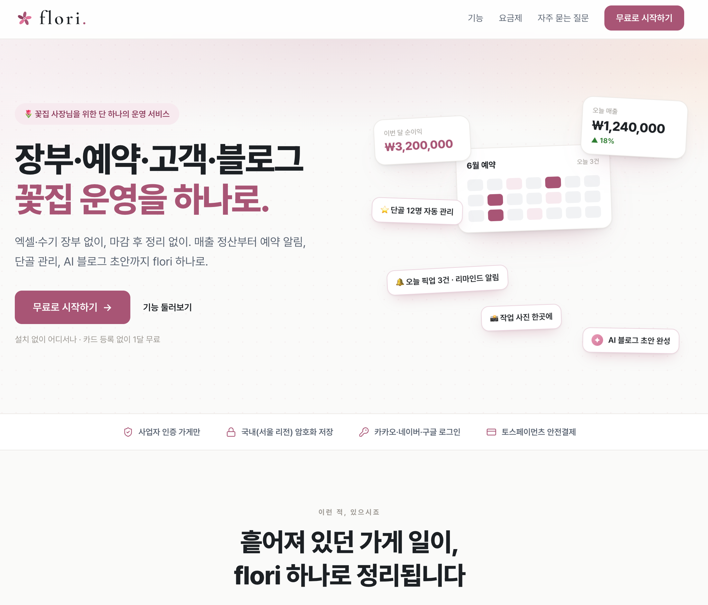
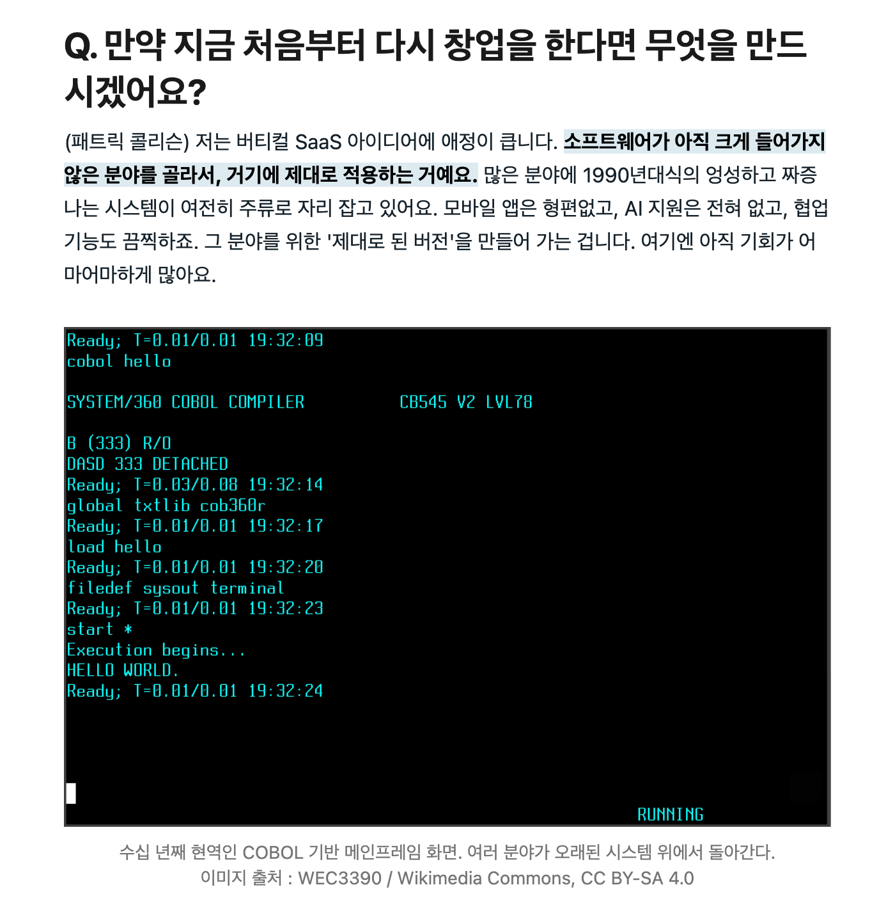

# 🎬 서론

오랜만에 글을 써본다!
블로그 스터디장인데 결석을 두 번이나 하다니.. 슬프지만 당장 먹고 사는 문제에 치여 어쩔 수 없었다는 핑계를 대본다.

벌써 퇴사를 한 지 2달이 넘었고, 6/29에 플로리를 출시 완료했다. 지금까지 느낀 점들과 앞으로 내가 나아갈 방향에 대해서 한 번 남겨보고자 한다.

---

# 🏃🏻‍♂️ 퇴사 직후

퇴사 후에는 바로 친구와 함께 패션 AI 에이전트를 약 3주간 빌딩했다.
안 좋은 이유는 아니고, 나의 개인적인 가치관으로 인해서 우리는 이별했고 나는 혼자서 꽃집 SaaS 'flori'를 만들게 되었다.

홀로 하는 것이 쉽지는 않았다. 외로운 감정도 있었고 모든 것이 나의 선택으로 결정되는 것이기 때문에 방향을 잡기가 어렵기도 했다.

다행히 친누나가 꽃집을 하고 있기 때문에 많은 소통을 하면서 방향을 나름 잡을 수 있었다. 원래도 누나를 위해서 만든 SaaS 이기도 했어서, 이를 고도화해서 출시한 것이었다.

시간이 넘쳐나고 시공간의 자유가 없다는 점. 내가 원한 것이었지만 이를 가지기 위해서는 더 큰 책임감이 필요했다. 나는 이 책임감을 견디기 위해서 자유로움을 온전히 즐기지는 못 한 것 같다.

그래도 건강은 많이 좋아졌다. 잠도 이전보다 많이 자고(8시간 이상) 운동도 거의 매일 하다보니까 좋아질 수 밖에 없었다. 무엇보다 내가 하기 싫은 것을 하지 않아도 되는 것과, 배가 고플 때 밥을 먹고, 카페를 가고 싶을 때 간다는 것 등의 자유가 스트레스를 많이 덜어주었다. 한 달만에 건강이 좋아지는 걸 보면서, 그동안 내가 얼마나 피폐하게 살았는지를 깨닫게 되었다.

---

# 🌸 플로리 출시

[flori 홈페이지](https://flori.ai.kr/)

플로리는 꽃집 사장님을 위한 SaaS이다. 현재는 웹서비스로만 이용이 가능하다.
이를 만든 이유를 간략하게 설명하자면 아래와 같다.

1. 꽃집은 대부분 1인 운영이다. (성수기에는 알바 또는 직원 1명 고용)
2. 대다수가 여성이며, 홀로 해야하는 일이 매우 많다. (꽃 사입, 매출관리, 예약관리, 고객관리, 마케팅 등..)
3. 꽃집 특화 운영관리 툴이 없다.

올해 2월 즈음인가 누나한테 간단하게 만들어주었는데 그때부터 잘 쓰고 있는 모습을 보고, 이를 공개해 다른 플로리스트분들도 쓸 수 있게 하는 것이 목적이었다.

그렇게 한 달 정도를 출시 준비에 매진했다.
할 게 굉장히 많았다...개발은 사실 한 30% 했나 싶고,
사업자등록 / 토스PG 심사 / 법적 문제 파악 등 행정적으로 할 일이 훨씬 많았다.

처음 해 보는 것이기 때문에 더 어려웠다. 만약 나중에 또 서비스를 빌딩할 일이 있다면 더 수월하게 할 수 있을 것 같다.

## 출시 이후 느낀점

모든 1인 사업자가 그러하듯, 나도 출시 후에 잘될 줄 알았다.
막연하게 생각한 것은 아니고 사전등록자도 30명 정도 모집했고, 그 안에서 진행한 설문에서도 기다리고 있다는 말들을 많이 들었기 때문이다. 이를 동력 삼아서 조금은 무리한 기한이었지만 출시를 할 수 있었다.

하지만 역시 현실은 차가웠다.
가입은 반 이상 해주셨고, 광고를 통해서 들어오시는 분들도 하루에 3명 이상씩 있었지만 정작 사용은 하시지 않았다.

처음에는 시간이 필요해서 그런 거라고 생각했다. 왜냐면 생각보다 기능이 많고 (페이지가 9개), 이런 툴을 많이 써보지 않으셨을 거라고 생각해서 `기능가이드`도 매우 꼼꼼하게 만들어두었기 때문이다.

> 그러나 이후에도 제대로 사용하시는 고객분들의 비율은 거의 0%였다.

한 이틀 정도 좌절했지만, 다시 정신을 차렸다. 방향성을 과감하게 바꿔야겠다는 생각을 했다.

---

# ⏩ 앞으로의 방향성

우선 내가 생각해 본 현재 서비스의 문제점은 아래와 같다.

## 서비스의 문제점

### '제대로' 쓰기가 어렵다.
기능 자체는 꽃집에서 필요한 게 맞다. (누나가 실제로 잘 쓰고 있음) 하지만 이를 사용하기에 진입장벽이 너무 높다. 아무리 필요로 하고 무료로 쓰게 해준다고 해도, **처음부터 버겁게 느끼면 이탈할 가능성이 매우 높다.**

### '앱'이 아니다.
매장에서는 대부분 노트북으로 관리하시니 데탑과 모바일 모두 가능한 웹으로 개발하고, PWA를 제공했다. 물론 내가 앱 개발을 안해보기도 했고, 빠르게 출시해야해서 그런 것도 있다. 하지만 준비하고 운영하면서 느낀 점은, 대부분 앱을 친숙하게 느끼시고 신뢰를 느낀다는 점이다. 또한 **스토어에서 검색으로 유입되는 고객들**이 굉장히 크다.

## 해결방안

### 꽃집 특화 AI 에이전트를 만든다.

현재 지원하지 않지만 고객분들이 원하는 기능이, 다양한 플랫폼에서 들어오는 예약 건들을 바로 연동하거나 빠르게 등록할 수 있게 하는 것이다.

이러한 예약과 매출, 고객, 사진 등을 플로리 AI에게 던지면 내부적으로 의도를 파악하여 등록하고 확인 및 안내한다. 즉, 현재는 각 페이지에 들어가서 직접 등록을 해야 했다면 대시보드 또는 챗봇 UI에서 모든 것을 할 수 있게 바꾸는 것이다. 이를 잘 구현한다면, **복잡한 기능을 이해할 필요 없이 직관적으로 서비스를 이용**할 수 있고, AI 비서를 가질 수 있게 된다.

원래부터 하고 싶었고 앞으로 나아가야 할 방향이라고 생각은 했었다. 하지만 시간이 부족했고 현재 있는 기능들을 잘 쓰실 수 있다고 생각해 빠르게 출시를 결정했었다. **이제는 그게 아니라는 것을 깨달았기 때문에 방향성을 빠르게 전환해야한다.**

### 앱으로 만든다.

AI 비서처럼 이용하기 위해서는 웹뿐만 아니라 앱으로도 지원해야 한다. 음성으로도 소통할 수 있도록 하는 것이 차후 목표이기 때문에, 이제는 앱을 빠르게 빌딩해서 운영해야 한다.

앱은 만들어 본 적이 없어서 약간 막막하긴 하지만, 요즘에는 워낙 혼자서도 잘 만드는 시대가 되었으니.. 앱을 만드는 것보다는 위에 있는 AI 에이전트를 구현하는 것이 난이도가 훨씬 높을 것 같다.

> **7월 내에 위 2가지 큰 목표를 달성하고 배포하는 것이 목표**이다!

---
#  🏁 마무리

요즘 들어 당연하게도 고민이 많다. 제일 고민인 것은, **"내가 만든 게 쓸모가 없으면 어떡하지?"** 라는 것이다.

내 것을 만들기 위해 뛰쳐나왔으나 사용하는 사람이 없다면 의미가 없다. 어쩌면 잘못 만든 것일 수도 있다.
이에 대한 의심을 끊임없이 하고 있지만, 필요성이 없다고는 생각하지 않는다.

> 정말 필요가 없었다면 사업자 인증까지 하면서 가입하지는 않을 것이다.

다만 문제는 **서비스의 방향성과 초기 유저에 대한 UXUI가 불친절했기 때문**에 발생했다고 본다.

## 버티컬 AI

오늘 본 칼럼에서 나온 내용 중 일부이다. 내가 현재 하고 있는 것이 정확히 `버티컬 SaaS`이다.

화훼 업계는 전통이 있고 계속해서 성장하고 있지만, 정작 AX는 커녕 DX도 안된 부분이 정말 많다. 이는 누나와 대화도 많이 해보고 꽃시장도 10번 이상 따라다녀 보면서 느낀 지점들이다. 모두들 이를 불편하게 느끼고 바꾸고 싶어하지만, 그만큼의 행동력이 있는 사람이나 서비스가 제공되고 있지는 않은 듯하다.

**아무도 만들지 않은 서비스라면, 그 서비스가 왜 없는지도 생각**해보아야 한다. 유저들이 그만큼의 필요성을 느끼지 못 했거나, 정말 니즈를 충족하기에 어렵기 때문일 것이다. 이 쪽 시장도 비슷하다고 느낀다. 오프라인으로 여전히 많은 작업들이 진행되고 있고, AI나 SaaS에 대한 친숙함이 떨어지기 때문에 쉽사리 접근할 수 없다.

또한 커뮤니티가 많지 않고, 개인적으로 활동하는 1인 사업자들이 많기 때문에 정보를 캐내기도 쉽지가 않다. 나도 친누나가 아니었다면 몰랐던 부분들이 정말 많을 것이다.

예전이었다면 이를 뚫기가 정말 어려웠을 것 같다. 하지만 이제는 행동력만 있다면 이전보다 수 십배 이상 빠르게 빌딩할 수 있는 시대이기 때문에 한 번 도전해볼만 한 것 같다.

원래는 단순하게 내 거 만들면서 돈도 벌고 노마드 코더로 살고싶다~! 였는데, 지금은 돈을 벌기는 커녕 서비스 만드는 시간을 얻기 위해 돈을 따로 벌어야 할 판이다. 그래서 마인드 자체를 `꽃집을 위한 AX를 내가 선도한다`로 바꿔야 그나마 성공할 것 같다.

뭐가 되든 간에 최소한 올해까지는 이 문제를 한 번 해결해보고 싶다. 앞으로도 꾸준히 기록을 남겨보도록 하겠다!

---

- 공식 홈페이지: https://flori.ai.kr/
- 공식 인스타그램: https://www.instagram.com/flori.ai.official/
- 공식 스레드: https://www.threads.com/@flori.ai.official/
- 공식 카카오 채널: https://pf.kakao.com/_eGxcXX/
